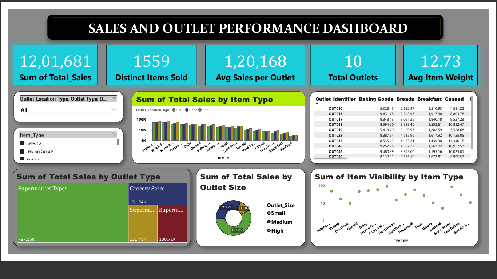

# 🛒 Retail Sales & Outlet Performance Dashboard
# Dashboard Preview
 
## 📌 Project Objective 
The objective of this project is to analyze retail sales and outlet performance data to identify:
- Best and worst performing outlets
- Sales distribution across item types
- Visibility and product-level analysis
- Key business KPIs (Total Sales, Unique Items Sold, etc.)
 

## 📂 Data Source
Dataset taken from a **publicly available GitHub repository** for practice purposes.

## 🧹 Data Cleaning & Preparation
- Removed duplicate records
- Handled missing values in "Item_Visibility" using *median imputation*
- Handled missing values in "Item_Weight" using *median imputation*
- Standardized categorical values (e.g., item types, outlet sizes)
- Built a *fact table* and linked with *dimension tables*

## 📊 Data Modeling
- Star Schema created with:
  - *Fact Table* → Total Sales
  - *Dimension Tables* → Items, Outlets
- Relationships built on "Item_Identifier" and "Outlet_Identifier"
- Applied cardinality and cross-filter directions appropriately

## 📈 Dashboard Features
- *KPIs Card*: Total Sales, Distinct Items Sold, Average Sales Per Outlet, Average Item Weight, Total Outlet
- *Visuals*:
  - Clustered Column Chart (Sum of Total Sales by Item Type)
  - Treemap (Sum of Total Sales by Outlet Type)
  - Matrix Table (Outlet Identifier × Item Type × Total Sales)
  - Pie Chart (Outlet Size Contribution)
  - Scatter Plot (Item Visibility vs Item Type)

- *Filters*:
  - Hierarchical slicer (Outlet Location Type → Outlet Type → Outlet Identifier)
  - slicer (Item Type)
  - Drill-down functionality

## 🔑 Key Insights
- TOP 3 PERFORMING OUTLETS - Certain outlets contribute significantly higher sales
  1.OUT035
  2.OUT046
  3.OUT013

- TOP ITEM TYPE - Fruits and Vegetables has Highest Sales
  
- ITEM VISIBILITY - During Analysis I found that Item Type plays major role in driving Sales because 
  Item which has Highest Sales also has Highest Visibility like Fruits and Vegetables has highest
  Total sales as well as highest Visibility on the other hand Sea Food has Lowest Total Sales as well as 
  Lowest Visibility.
 
- OUTLET TYPE - Supermarket type1 shows highest Sales 
                Supermarket type3 has Lowest Sales

- OUTLET SIZE - Small Sized Outlets has Highest Total Sales
                High Sized Outlets has Lowest Total Sales

## 🚀 Tools & Skills Demonstrated
- *Power BI*
- Data Cleaning & Transformation
- DAX Calculations
- Data Modeling (Star Schema)
- Interactive Dashboard Building
- Business Insights Communication

